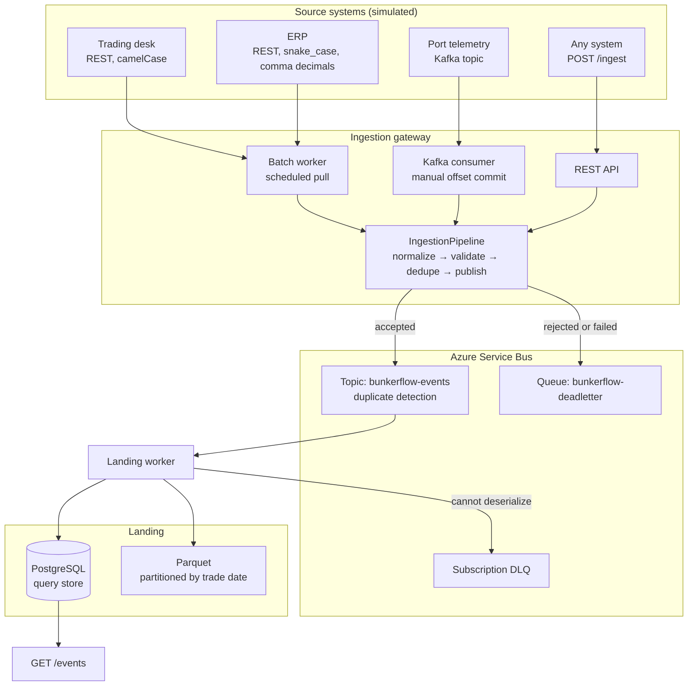

# BunkerFlow

An event-driven integration gateway for bunker fuel trade data. It ingests from
business systems both as scheduled batch pulls and as real-time streams,
normalizes everything onto one event contract, routes it through Azure Service
Bus, and lands it in a lakehouse-style store, with a REST API and metrics on
top.

It is the integration layer of a unified data platform, built small enough to
run on one machine.

## Architecture



Three ingestion channels, one pipeline. Adding a fourth source is an adapter and
a few field aliases, not a new code path.

## What is in here

| Area | What it does |
| --- | --- |
| Event contract | `IntegrationEvent` with a deterministic event id derived from source system plus source record id |
| Normalization | Alias-driven field mapping, so each source keeps its own field names; handles comma decimals and mixed timestamp offsets |
| Data quality | IMO check-digit validation, UN/LOCODE format, known fuel grades, quantity and price ranges, future-dated trades |
| Idempotency | Reserve-then-release on the business key, atomic in Postgres via the primary key |
| Messaging | Service Bus topic with a deterministic message id, application properties for subscription filters, retry with full-jitter backoff on transient errors only |
| Dead-lettering | A dedicated queue for records rejected before publication, and the subscription's own DLQ for ones that fail after delivery |
| Landing | Postgres for querying, Parquet partitioned by trade date for the lakehouse |
| API | `POST /ingest`, `POST /ingest/batch`, `GET /events`, `GET /health/live`, `GET /health/ready`, `GET /metrics`, OpenAPI |
| Auth | API key on the ingest and query endpoints, compared in constant time, with a key list so rotation does not break callers |
| Observability | Structured logs and Prometheus counters broken out by outcome and ingestion channel |
| Infrastructure | Terraform for the namespace, topic, subscription, subscription rule, dead-letter queue and send-only auth rules |
| CI | Build, test, `terraform fmt`/`validate`, and both container images |

## Running it

### Quickest look, no infrastructure

With no Service Bus connection string configured the gateway runs in loopback
mode: events are landed in-process so the whole thing is demonstrable without
Docker.

```bash
./scripts/smoke.sh
```

That starts the API, pushes a valid trade, replays it (duplicate), sends one
with a broken IMO check digit (rejected), pulls twenty records from the
simulated ERP endpoint, then prints the landed events and the metrics.

### The full stack

```bash
docker compose up --build
./scripts/seed-kafka.sh     # puts four trades on the Kafka topic
```

Brings up PostgreSQL, Redpanda for the Kafka path, Microsoft's Service Bus
emulator, the API and the worker. The batch workers start polling the simulated
sources immediately; the seed script exercises the streaming path.

```bash
curl localhost:8080/health/ready              # landed count
curl localhost:8081/metrics                   # worker counters, by channel
curl -H "X-Api-Key: local-dev-key" "localhost:8080/events?limit=5"
```

`/ingest` and `/events` require an API key; health and metrics stay open so
probes and Prometheus can reach them. The compose stack sets an obvious
throwaway key so the authenticated path is actually exercised. With no keys
configured the endpoints are open, which is what the quickstart above relies
on, and the API logs a warning saying so at startup.

The worker exposes its own health and metrics on port 8081. It does most of the
ingesting, so its counters are the ones worth scraping; the API's port 8080
counters cover only what was pushed to `/ingest`.

A run from a clean volume looks like this:

```
bunkerflow_records_total{outcome="accepted",channel="batch"} 46
bunkerflow_records_total{outcome="accepted",channel="stream"} 3
bunkerflow_records_total{outcome="duplicate",channel="batch"} 24
bunkerflow_records_total{outcome="rejected",channel="batch"} 3
bunkerflow_records_total{outcome="rejected",channel="stream"} 1
```

The duplicates are the batch pullers re-polling sources that return overlapping
data. The rejections are records whose IMO check digit does not compute; the
simulated ERP feed emits one every seventh record on purpose so the dead-letter
path is visible rather than theoretical.

### On Databricks

`notebooks/bunkerflow_lakehouse.py` takes the gateway's Parquet output and
builds Delta tables from it: bronze as landed, silver with standardized column
names and deduplication on event id, gold aggregated by port and fuel grade.

It reads `samples/landing/`, which is real output from a compose run committed
to this repo: 50 events, 47 from the batch pullers and 3 from the Kafka topic.
So it runs on a fresh [Databricks Free Edition](https://login.databricks.com/?intent=CE_SIGN_UP)
workspace with no cloud subscription and no setup beyond signing in.

Import it with **Workspace → Import → File**, then Run all.

### Tests

```bash
./scripts/test.sh          # fast suite, no containers
./scripts/test-broker.sh   # against a real Redpanda container, needs Docker
```

The fast suite covers the normalizer, the validators, the retry policy, the
dedupe store, the pipeline's outcome paths, the Parquet round-trip, API key
enforcement, and the API driven end to end in-process.

The broker suite starts a real Redpanda through Testcontainers and drives the
Kafka consumer against it, because the offset rules cannot be proved with a
fake: a record that failed to publish must leave its offset uncommitted and be
redelivered, while one rejected on data quality must be committed and
dead-lettered. CI runs it as its own job.

### Infrastructure

```bash
cd infra/terraform
terraform init -backend=false
terraform validate
```

`terraform plan` and `apply` need an Azure subscription. CI runs `fmt` and
`validate` on every push.

## Design notes

**Reserve-then-release, not mark-as-seen.** The dedupe store claims the business
key before publishing and gives it back if publishing fails. Marking a key as
seen up front would make a retry of a failed publish look like a duplicate, and
the trade would be lost silently. The test
`Should_release_the_business_key_when_publishing_never_succeeded` pins that
behaviour.

**Deterministic event ids.** The event id is a hash of source system plus source
record id, so a replayed record produces the same id every time. That is what
lets Service Bus duplicate detection reject a repeat before any consumer sees
it, with the application-level dedupe store as the durable backstop.

**Transient and permanent failures are different types.** The retry policy only
retries `TransientPublishException`. A missing topic or an oversized payload
fails on the first attempt instead of spending the retry budget on something
that cannot succeed.

**Liveness does not check dependencies.** `/health/live` says whether the
process is up. Tying it to the database would make an orchestrator restart a
healthy pod during a database blip. `/health/ready` is the one that checks.

**Validation reports every failure, not the first.** A source system fixing one
field at a time and resubmitting is a slow loop for everyone involved.

**A failed publish does not commit the Kafka offset.** If the record could not
be handed to the bus, the consumer seeks back rather than committing, so the
broker redelivers it once the infrastructure recovers. Committing regardless
would lose the trade during exactly the outage you built the retry for. This
turned up while running the stack: the Service Bus emulator was still starting,
one streamed record failed to publish, and its offset had already moved on.

A rejected record is the opposite case and is committed, because resending the
same bad data would only fail again; it goes to the dead-letter queue instead.
Both rules are pinned by `KafkaOffsetCommitTests` against a real broker.

## Scope, honestly

- **The source systems are simulated.** `/mock-sources/*` generates trade data
  in two deliberately different shapes. There is no real ERP behind it.
- **The Databricks notebook reads a committed sample, not a live feed.** It runs
  on Free Edition and builds real Delta tables from real gateway output, which
  shows the format and partitioning are right. Pointing the landing writer at
  cloud object storage that Databricks reads directly is a configuration change
  to `Landing__ParquetRootPath`, and it has not been done.
- **Microsoft Fabric is a documented target only.** Nothing has been deployed
  to it.
- **Terraform is validated, not applied.** The configuration is real and CI
  checks it; provisioning it needs an Azure subscription.
- **API authentication is a shared key, not per-caller identity.** It is enough
  to keep the gateway from being open to anyone who can reach it, but it does
  not tell two source systems apart. OAuth or mTLS is the real answer.
- **Service Bus authentication is a send-only SAS connection string.** Moving
  both hosts to a managed identity is the next hardening step, and
  `local_auth_enabled` is already a variable for it.
- No horizontal scaling, no multi-region, no schema registry.

## Repository layout

```
src/BunkerFlow.Contracts     the shared event contract and serializer settings
src/BunkerFlow.Integration   normalization, validation, dedupe, retry, messaging, landing
src/BunkerFlow.Api           REST gateway, health, metrics, simulated sources
src/BunkerFlow.Worker        batch puller, Kafka consumer, Service Bus landing worker
tests/                       fast xUnit suite plus the broker-backed suite
infra/terraform              Azure Service Bus as code
infra/servicebus-emulator    emulator topology for the compose stack
notebooks/                   Databricks bronze/silver/gold over the landed Parquet
samples/landing/             real gateway output, so the notebook needs no setup
```

Built with .NET 10 and Claude Code.
