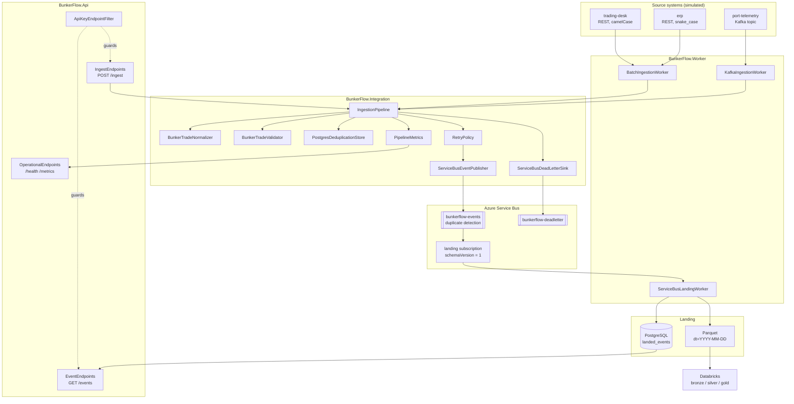
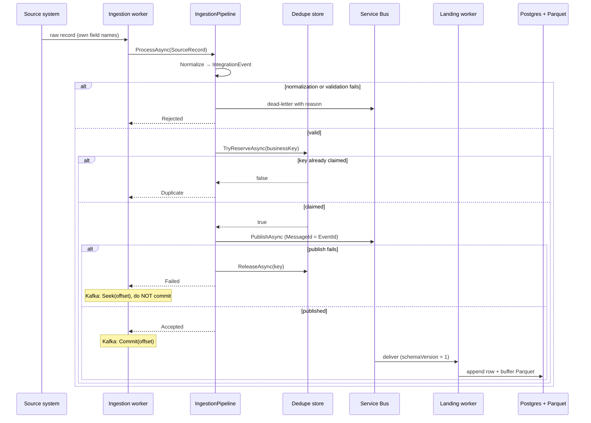
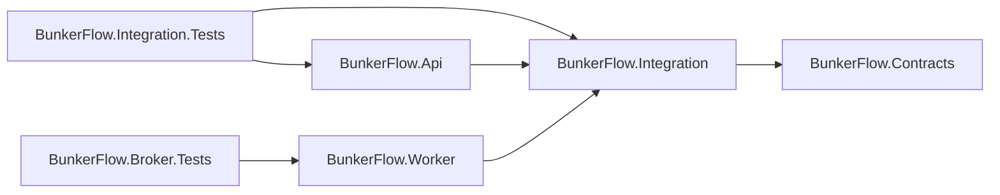
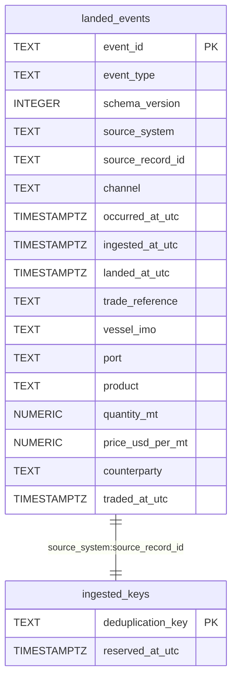

# BunkerFlow — Architecture Diagrams

Generated with the `architecture-diagram` skill. Components and edges taken from the
graphify knowledge graph (734 nodes, 1,461 edges) plus the project files and DDL.

## System Architecture

## Data Flow

## Dependency Graph

## Database Schema

`ingested_keys` has no foreign key to `landed_events` — the claim is taken *before*
publication and released if publishing fails, so a key can exist with no landed row.
The relationship is by convention on the business key, not enforced by the database.
